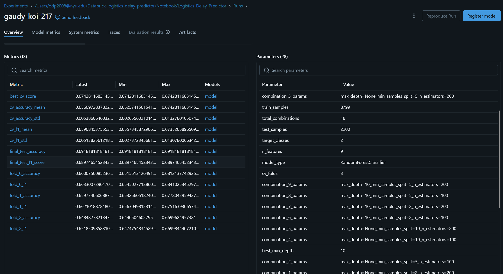
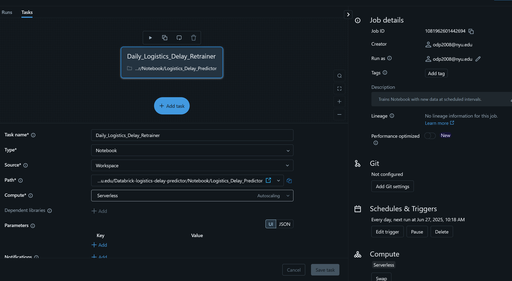
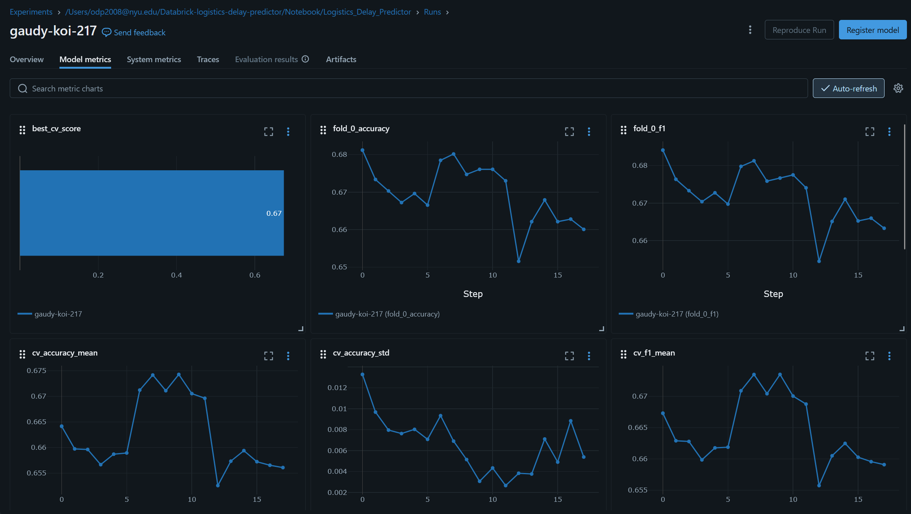

# Logistics Delay Predictor

This project is a full machine learning pipeline designed to **predict delivery delays** in a logistics network using historical shipment data. It was built to **explore Databricks free-tier capabilities** in the context of **logistics and supply chain optimization**.

---

## 🚚 Project Objective

To classify whether a shipment is likely to be **delayed or on time**, based on features such as:
- Mode of shipment
- Warehouse block
- Product importance
- Customer ratings
- Discount and weight

---

## 🧱 Built With

- **Databricks**: Full pipeline execution, job scheduling, cluster management
- **PySpark + Pandas**: Data loading and EDA
- **scikit-learn**: Model training, hyperparameter tuning
- **MLflow**: Experiment tracking, parameter logging, metric visualization

---

## 🔍 Key Features

- 📊 **Exploratory Data Analysis** to understand delay patterns across routes and shipment types
- 🧪 **Hyperparameter tuning** via `GridSearchCV` with logging of each combination
- 📈 **MLflow Tracking**:
  - Logs parameters, metrics, fold-wise CV scores
  - Stores model artifacts with input/output signature

  

- 🔁 **Automated retraining** with Databricks **scheduled Jobs**

  
- ✅ Model evaluated with accuracy and F1-score, and tracked over time

---

## 📆 Automation & Scheduling

The entire notebook is now wrapped into a **Databricks Job** that runs daily, allowing:
- Continuous monitoring of performance
- Easy integration with data updates
- Transparent experiment tracking via MLflow

## 📈 Results Summary

The best model achieved:

- Accuracy: ~64%
- Weighted F1-score: ~69%
- Most important features: **Discount offered**, **Weight**, **Mode of Shipment**

---

## 🔄 Future Enhancements

- Load daily data automatically from cloud storage
- Deploy model endpoint with **FastAPI**
- Use **Delta Lake** or **Databricks Autoloader** for streaming data
- Save model version to `dbfs:/models/latest_rf_model.pkl` for serving
